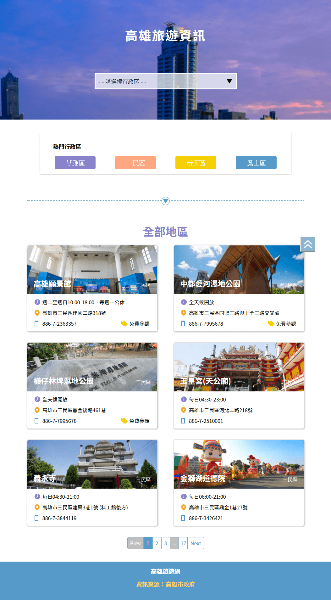
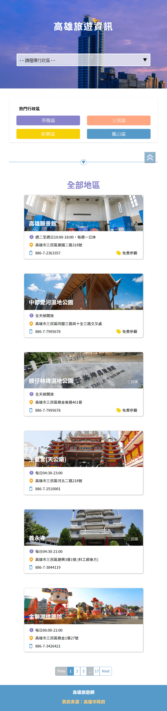
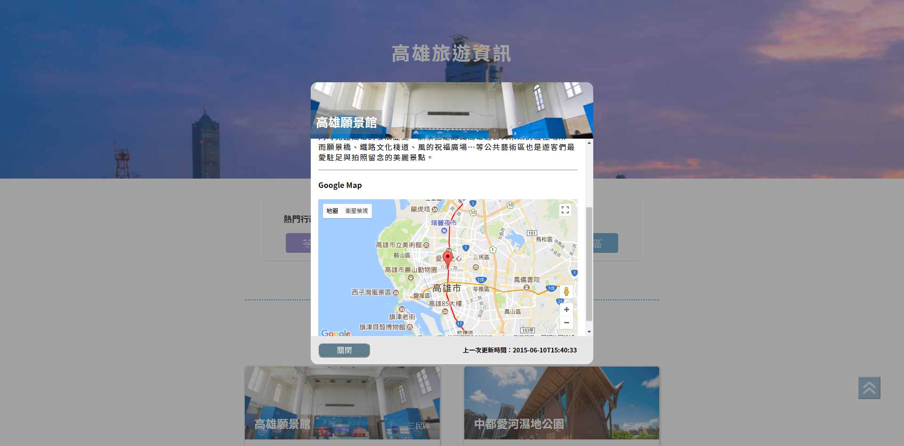

# 高雄旅遊景點導覽





> 近日重新練習 JavaScript 並做了高雄旅遊景點導覽的網頁，使用高雄政府資料開放平臺的 OPENDATA，紀錄這次使用到的功能及心得。

---

[Demo Link](https://tpwilovepanda.github.io/Kaohsiung-Travel-Information/index.html)
[GitHub Link](https://github.com/TpWILovePanda/Kaohsiung-Travel-Information)

---

## 簡介

使用 HTML、CSS、JavaScript 的應用。

## 學習清單

* CSS Flex 屬性運用
* JavaScript Ajax 取得高雄市政府資料開放平台的 Open Data
* JavaScript ES6 樣板字面值渲染資訊
* JavaScript **監聽事件**選擇行政區觸發事件來更新資訊
* JavaScript **上下頁面切換**與 **Web History API** 操控來更新資訊
* Google Map Api 實際應用

---

## querySelector & querySelectorAll

元素選擇器，可用 CSS 規則作為選擇。

```html
<div id="example-id">example-id</div>
<div class="example-class-all example-class-1">example-class-1</div>
<div class="example-class-all example-class-2">example-class-2</div>
<div data-index="1">index 1</div>
```

我們要用 JavaScript 選取以上的 DOM 元素，該如何選取呢？

```js
// 選取 example-id 資料
var example_id = document.querySelector('#example-id');
// 選取 example-class-1 資料
var example_class_1 = document.querySelector('.example-class-1');
/**
 * 選取 example-class-1 與 example-class-2 資料
 * 如果用 querySelector('.example-class-all') 只能選取到 example-class-1
 * 用 querySelectAll('.example-class-all') 會取得 [example-class-1, example-class-2]
 * 想取得 example-class-2 要用 example_data_all[1]
 */
var example_class_all = document.querySelectorAll('.example-class-all');
// 選取 data-* (*: 可替換任何參數) 資料
var example_data_index = document.querySelector('div[data-index="1"]');
```

---

## addEventListener

綁定事件，使用方法是 `addEventListner(事件, 執行內容, useCapture)`。

### 事件

指的是要偵測的事件，點擊 `click`，內容變換 `change`、鍵盤動作 `keyCode`...等等。

> 提示： [事件參考手冊](http://www.runoob.com/jsref/dom-obj-event.html)

### 執行內容

執行的函式，可以直接指定函式或直接撰寫函式。

```js
// 指定函式
document.body.addEventListner('click', exampleFunction, false);
// 指定函式傳參數
document.body.addEventListner('click', function(e) {
    exampleFunction(parameter);
}, false);
// 直接撰寫函式
document.body.addEventListner('click', function(e) {
    // ...
}, false);

```

### useCapture

Boolean 值，預設參數為 `false`。`false` 值是 Bubbling (冒泡)，由底層元素向最上層元素依序觸發事件。`true`值是 Capture (捕獲)，由最上層向下捕捉出發事件。

```html
<style>
    .father {
        padding: 20px;
        background-color: yellow;
    }
    .child {
        padding: 20px;
        background-color: blue;
    }
</style>

<div class="father">
    <div class="child"></div>
</div>

<script>
    document.querySelector('.child').addEventListener('click', function() {
        console.log('child!')
    }), false);
    document.querySelector('.father').addEventListener('click', function() {
        console.log('father!')
    }), false);
</script>
```

點擊 `.child` 觸發事件順序是 `child!` > `father!`，下層向上層如冒泡。

```js
document.querySelector('.child').addEventListener('click', function() {
    console.log('child!')
}), true);
document.querySelector('.father').addEventListener('click', function() {
    console.log('father!')
}), true);
```

點擊 `.child` 觸發事件順序是 `father!` > `child!`，上層向下曾捕捉。

```js
document.querySelector('.child').addEventListener('click', function() {
    console.log('child!')
}), false);
document.querySelector('.father').addEventListener('click', function() {
    console.log('father!')
}), true);
```

點擊 `.child` 觸發事件順序是 `child!` > `father!`，下層向上層如冒泡。

```js
document.querySelector('.child').addEventListener('click', function() {
    console.log('child!')
}), true);
document.querySelector('.father').addEventListener('click', function() {
    console.log('father!')
}), false);
```

點擊 `.child` 觸發事件順序是 `father!` > `child!`，上層向下曾捕捉。

---

## `function(e) { }`

`e` 是 `event` 簡寫， `event` 事件裡面有許多資訊。

```js
document.querySelector('.example').addEventListener('click', function(e) {
    console.log(e);
}), false);
```

當點擊事件出發後，將會看到關於此點擊的資訊可以觀察。

### 常用的 `event` 方法

* `e.target.value`
* `e.target.nodeName`
* `e.target.textContent`
* `e.target.className`
* ``

---

## XMLHttpRequest

使用 AJAX 取的高雄市政府 OPEN DATA。

```js
/**
 * 高雄市政府開放資料
 * 透過 AJAX 取得 JSON 資料
 */
function requestData() {
    // 建立一個新的 XMLHttpRequest
    let xhr = new XMLHttpRequest();
    // 設定 xhr 來 get(取得) 放在 高雄市政府開放資料的 JSON 資料值
    xhr.open('get', urlForAjax, true);
    // 送出 xhr 請求
    xhr.send(null);
    // 當取得 xhr 回應, 執行此 function
    xhr.onload = function () {
        // 4: 請求已完成, 響應已就緒. 200: "OK"
        if (xhr.readyState == 4 && xhr.status == 200) {
        let openData = JSON.parse(xhr.responseText);
        records = openData.result.records;
        // 分析網址參數, 帶入渲染函式
        let urlParamsObj = (urlParams() ? urlParams() : {
            type: '',
            page: ''
        });
        renderContent(urlParamsObj.type, urlParamsObj.page);
        } else {
        console.log("資料錯誤!");
        }
    }
}
```

---

## Web APIs > History

此次用到的方法有 `history.pushState(state, title, url);` 與 `popstate`。

```js
window.addEventListener('popstate', function (e) {
    // ...
}, false);
```

`pushState` 是寫入歷史紀錄，`popstate` 是監聽上下頁面切換事件。

> 參考資料
> * [操控瀏覽器歷史紀錄](https://developer.mozilla.org/zh-TW/docs/Web/API/History)
> * [History](https://developer.mozilla.org/zh-TW/docs/Web/API/History_API)
> * [`History.pushState()`](https://developer.mozilla.org/zh-CN/docs/Web/API/History/pushState)

---

## 總結

獲益良多，繼續學習，前端好好玩！